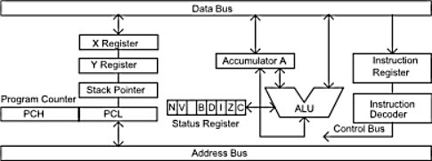
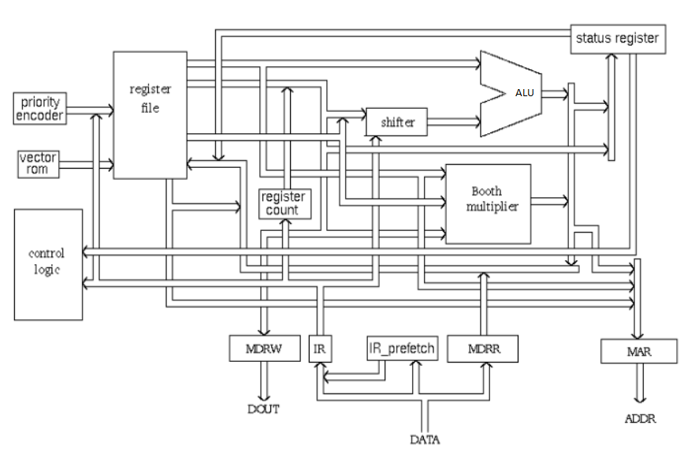

# Digital Design and Computer Architecture
## fp_1: Microprocessor Language Design  
    
## Introduction
For the first half of MP1 you will start by comparing two real world processors. You will compare their intended purpose, their instruction sets, their architecture, performance etc. This step will help you understand other possibilities for instruction sets and instruction set formats. It will also help you understand the architecture behind real world processors. This first part may be more challenging if you pick an obscure processor or a proprietary processor that does not have much information available about it online. 

Fill out the answers to your work directly in this Document and submit to Whitgit.

For the second half of FP_1 
1.	You will decide on what type of processor you want to target (e.g. general purpose or special purpose dedicated processor: e.g. graphics, a.i., dsp, etc.) 
2.	You will design a new, original instruction set (i.e. assembly language) for this type of processor that can run non-trivial programs.  
3.	You will then design the machine code format for your instruction set.  
4.	You will write an assembler program that uses your new, original, assembly language (for testing purposes).
5.	You will create an assembler to convert text based assembly language into a hex code machine format.
6.	You will “assemble” (i.e. convert) each of these programs into your machine code.  

Preview of future FP labs: This lab sets the stage for the next project where you design the ALU and DPU for your original processor.  Your group must create an original processor / control unit / data path unit and NOT simply copy an existing processor design that you find out on the Internet.

# Processors of the World Comparison

Compare the hardware architectures and assembly/machine languages for any two different processors (groups of two) and three different processors (groups of 3) of your choice. Decide on the specific application area you want your processor to focus on. Are you interested in general purpose? audio? graphics? encryption? security?  We suggest that you pick at least one processer that you are interested in learning more about. Below are some suggestions that have information for them online. Each person in the group is responsible for ONE different processor and will be graded on that individually.

1.	Old Style Intel 8080 or 8085 Architecture
    * http://en.wikipedia.org/wiki/Intel_8080 
    * http://www.intel-vintage.info/intelotherresources.htm#906748189 

2.	Old Style Motorola 6502 Architecture
    * http://www.visual6502.org/welcome.html
    * http://en.wikipedia.org/wiki/MOS_Technology_6502 
    * http://opencores.org/project,t65

3.	Modern General Purpose ARM Architecture
    * http://en.wikipedia.org/wiki/ARM_architecture
    * https://www.scss.tcd.ie/~waldroj/3d1/arm_arm.pdf 

4.	Modern Application Specific NVIDIA Architecture (Graphics Processor)

5.	Modern AMD Architecture (e.g. Ryzen)

6.	Other processor of your own choice (other than MIPS) that you can find information for.


## Exercise 1: Comparing and Contrasting Processor Designs

1. What is the application area of the  processor you chose? 
   6502 - general/multipurpose microprocessor most often used in video game consoles and computers, today it is widely used in embedded systems
   ARM - general purpose, commonly used in consumer electronics due to small size
2. What "registers" does your chosen processor use? Make a table similar to Table 6.1 MIPS Register Set on page 300 of your book

|6502 - Name|Number|Use|
|-----|-----|-----|
|Accumulator (A)|N/A|Handles all arithmetic and logic (8-bit)|
|X and Y|N/A|General purpose registers (8-bit)|
|S|N/A|Stack pointer (8-bit)|
|P|N/A|Processor status (8-bit)|
|Program counter|N/A|Points to next instruction to be executed (16-bit)|

|ARM - Name|Number|Use|
|-----|-----|-----|
|R0-R7|0-7|General purpose registers, no special uses|
|R8-R12|8-12|Separate FIQ mode versions allow for fast interrupt processing|
|SP|13|Stack pointer|
|LR|14|Link register, used to hold subroutine addresses|
|PC|15|Program counter|
|CPSR|16|Current program status register. Contains flags, interrupt disle bits, current processor mode and other status/control info|
   
3. Find the instruction operation information for four different types of instructions. If possible, find the machine code format, this may not be possible for the processor you chose, but do your best to find the lowest level instruction information possible for your processor.

|6502 - Name|Opcode|Type of Instruction|What it does|Machine code format|Machine code example|
|-----------|------|-------------------|------------|-------------------|--------------------|
|Branch on result zero|BEQ oper|Branch|Jump to different place in instruction set|F0|$F0|
|Increment Y|INY|Increment|Increment Y register by one|C8|$C8|
|Load X|LDX oper|Load|Load index X with memory|A6 data|$A6 02|
|Store X|STX oper|Store|Store index X in memory|86 data|$86 01|

|ARM - Name|Opcode|Type of Instruction|What it does|Machine code format|Machine code example|
|----------|------|-------------------|------------|-------------------|--------------------|
|EQ|0000|Conditional|Sets Z flag if equal|operand EQ operand|None found|
|AND|0000|Data-processing instruction|Logical and operation|AND{cond}{S} Rd, Rn, sifter_operand|AND R9, R2, #0xFF00|
|ADD|0100|Data-processing|Performs an addition|ADD{cond}{S} Rd, Rn, shifter_operand|ADD Rx, RX, #1|
|B|None|Branch|Branches to label|B{L}{cond} target_address|B tester|
|SMMUL|None|Multiply|Multiplies 32-bit values of two registers together and stores the top 32 signed bits of the signed 64-bit result in a third register|SMMUL{R}{cond} Rd, Rm, Rs|SMMUL R6, R4, R3|

4. High level block diagram of your processor. Compare and contrast the design of your processor with another processor that someone in your group chose.  Here are questions that can help guide you in the comparison process. You may not be able to answer all the questions, but do your best:

    a. What does the data path look like for each processor? Find a high level architecture diagram that shows the data path for each processor. Insert both diagrams here:<br />
    
    

    b.	What types of memory (register, cache, etc.) does each processor contain or access? 
    6502 - Registers and RAM
    ARM - Registers

    c.	How is/are the ALU(s) connected to the registers (refer to the diagram in part a)?
    6502 - ALU is connected via the 8-bit data bus
    ARM - ALU is connected to registers via a 32-bit input from the register file

    d.	How are instructions fetched and executed? Is there an instruction cache? 
    6502 - No instruction cache, but instructions can be read while still carrying out previous instruction
    ARM - After a pipeline flush all instructions are fetched from cache or memory. However, most ARM implementations prefetch instructions ahead of the currently executing instruction.

    e.	Does the processor pipeline instructions? 
    6502 - No deep pipeline, but allows for the next byte (instruction/operand) in the program to be fetched while figuring out what happens with the current instruction/operand.
    ARM - The general-purpose ARM architecture pipelines its instructions, as well as doing a pipeline flush to flush out instructions.

    f.	What is the clock speed of the processor?
    6502 - 1-2 MHz depending on model
    ARM - 1.9-2.16 MHz depending on model

## Exercise 2: Processor Language Design

   Design the programmer’s view of the architecture for your processor (as a group).  Just like in part 1, you will make two tables. The first table will be the registers and the second table the instructions for your processor. 
   
|Name|Number|Use|
|----|------|---|
|R0-R61|0-61|62 general purpose registers|
|PC|62|Program counter|
|SP|63|Stack pointer|

|Name|Opcode|Type of instruction|What it does|Machine code format|Machine code example|Machine code explanation|
|----|------|-------------------|------------|-------------------|--------------------|------------------------|
|ADI|0|Arithmetic|Add immediate value to destination register|00xx(16-bit immediate value)|00010022|Adds 0x0022 to R1|
|ADD|1|Arithmetic|Add register value to destination register|01xxyyzz|01010203|Adds registers 2 and 13 stored in register 1|
|AND|2|Logical|Compute bitwise AND of two registers|02xxyyzz|02010708|R7 AND R8 stored in R1|
|ORR|3|Logical|Compute bitwise OR of two registers|03xxyyzz|03010304|R3 OR R4 stored in R1|
|XOR|4|Logical|Compute XOR of two registers|04xxyyzz|04010506|R5 XOR R6 stored in R1|
|BEQ|5|Branch|Branch if equal|05xxyy(offset)|050602(address)|Branch if R6 = R2|
|JMP|6|Jump|Jump to calculated address|06(target)|06(address)|Jumps to target in program|
|SLL|7|Arithmetic|Logical shift left|070801(shamt)|07010202|Shift R2 left 2 places, store in R1|
|SRL|8|Arithmetic|Logical shift right|080201(shamt)|08020102|Shift R1 right 2 placesm, store result in R2|
|SUB|9|Arithmetic|Perform subtraction|09xxyyzz|09010102|Subtract R2 from R1, store in R1|


#### Tips
* Don’t start with too many instructions!  
* Have some stretch instructions as well as basic instructions.  
* Each person in the group (after group consultation) must be personally responsible for the hardware of at least one instruction. 
* Your processor will need enough instructions to do useful work. You must have enough instructions to be able to run a useful program.


## Exercise 3: Assembler for your Processor
Create an assembler for your processor. Put your assembler code in a sub-folder of your group project. 

### Simpler Assembler
For example you could create a simple program that reads your assembly language program word by word and then converts each line to machine code.  Here is some possible pseudo code for a simple assembler: 

```
Read in the variable definitions from the top of the program. 

For each variable in the definitions list: 

    Determine the size of memory required 

    Insert the variable into a dictionary that
    stores the assigned memory address of the variable. 

    Compute the memory location for the next variable. 

For each line of assembly: 

    NextHexCode = “” 

    Strip comments from the line of code read 

    If line of code has a label:  

        Store memory location of the label in a dictionary 

        Determine the assembly keyword on the line of code 

        Based on assembler keyword update NextHexCode contents

    If line of code has arguments  

        Based on argument types (register, variable, immediate) 
        and instruction type update NextHexCode 

    Write NextHexCode to the output machine code file. 

End For
```
### Another Option

* Define a grammar for your assembly language and build a recursive descent parser (https://en.wikipedia.org/wiki/Recursive_descent_parser ) 
 
* Use the utilities Lexx and Yacc (you will have to learn these on your own) 

## Exercise 4: Assembly Language Code
Write an assembly language program using the language that you designed.  Use your assembler from exercise 3 to compile the assembly language into hex based machine code. 

Include your assembly language code program here (make sure your program includes comments) 


### Make sure to push your changes to Whitgit!

## Rubric


| CATEGORY | Poor or missing attempt | Beginning  | Satisfactory | Excellent  |
|:--------:|:--------:|:--------:|:--------:|:--------:|
| Exercise 1: Comparing Processors  | Missing or extremely poor quality. | Low quality comparison of processors.  Questions answered poorly and instructions not followed. | Adequate comparison of both processors architecture, machine code, and assembly language | Excellent comparison of both processors architecture, machine code, and assembly language instructions and format. |
| Exercise 2: Assembly Language Design | Missing or extremely poor quality. | Beginning design. Done quickly without much thought.. | Satisfactory design. | Excellent design. Good opcode choices and architecture. |
| Exercise 3: Assembler | Missing or extremely poor quality. | Hard coded assembler with few comments. No variables or labels (values are hard coded in the instructions)  | Adequate assembler with one of either variables or labels. Adequately commented. | Well commented, comprehensive assembler program that supports labels and variables. And a useful program. | 
| Exercise 4: Assembly Language and Machine Code | Missing or extremely poor quality. | Hex listing without assembly language. |  Adequate assembly language program and associated working machine code. | Excellent assembler with comments, excellent assembly language program  |

## What to Hand In:  

* All the answers to the questions should be formatted neatly in a markdown file and submitted to the whitgit group project folder. 
* Be sure to check the evaluation rubric given here. 
