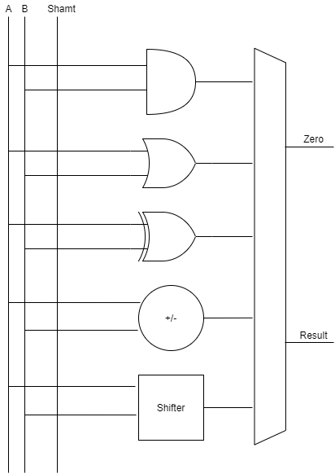
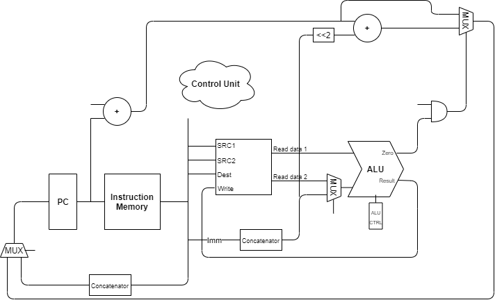

# Digital Design and Computer Architecture
## FP_2: DPU and ALU Design and Integration

# Introduction    
In this lab you will design the Data Path Unit for your processor and verify that your instructions are working correctly.  The Data Path Unit is the core hardware of your machine that executes instructions.  It takes the instruction from the instruction memory and routes the registers, immediate values, etc. to the ALU. The result of ALU computations then route to either the data memory or back to the registers.  

You will first design the final ALU for your processor and then, design the data path unit (i.e. the connections between the ALU, registers, and external memory).  This means that besides the ALU and the DPU, you will start thinking about how you want to implement the memory for your device.  For now, it makes sense to keep the memory implementation on the FPGA because interfacing to an external memory can be complex. You may wish to include a port for an external input/output devices, but your microprocessor should be able to function without this (just like the MIPS design was able to function without an external memory or I/O)  

# ALU Update or New Design
In the first part of this lab, you will design an ALU with operations to support your language. Here are some suggestions for ALU operation, however, you are not required to implement these if your processor does not require them: 

* shifters (shl, shr) 
* arithmetic (add, sub, mul, div) 
* comparison (lt, gt, lte, gte, eq) 
* bitwise logical operations (and, or, xor, inv, etc.) 
* special purpose operations? (Are you designing a special purpose processor?) 

Additionally, if you are going to have more than one “core” for supporting parallelism, you will want to keep the ALU as simple as possible.  Remember that multiplication can actually be done in software with a shift/add algorithm if you need to make a super simple ALU.  

Finally, start thinking about the future. After you add the control unit (in a future lab), you will be required to add I/O capability to your processor. Will you have a dedicated I/O instruction or will you treat I/O like memory and read / write to a specific memory address? 

## What to Hand In
All of the following materials (except individual reflections) should be pushed to the __group repository__ on Whitgit. 

Individual reflections will be placed in this document pushed to your private CS401 version of this repository on Whitgit.

## Make sure to have a correct .gitignore for the VHDL code!

## Exercise 1: Update ALU or New ALU Desgin
Make sure to work as a group and that all members contribute.  Make sure all members understand all parts of the design and implementation.  

As a group, choose your ALU operations carefully: 

* Given the language you designed in the previous project MP1, you will identify all the mathematical operations required by the ALU. Make a table of the chosen ALU operations with a description of each operation. Leave space for adding additional operations if needed. (See page 249 in your textbook for an example table) Include the table here: 

* Draw a neat, accurate, detailed hardware diagram of your ALU. I recommend doing this with an online Electronics CAD program or by using VHDL modules. Include your hardware diagram here. Again, I highly encourage you to use a schematic drawing tool or make the diagram with VHDL modules.  There are several free schematic tools available online, you can even use LTSpice if you wish, but, please create a professional looking hardware diagram. 

* Create the VHDL implementation for just the ALU. Be sure to comment your code adequately. Include your neatly formatted VHDL code for the ALU here: 



* Make a VHDL test bench to verify that the hardware for the new ALU design works. Be sure to comment your test bench code for your ALU adequately. Include your neatly formatted VHDL test bench code here: 

```
library IEEE;
use IEEE.STD_LOGIC_1164.ALL;
use IEEE.NUMERIC_STD.ALL;

entity sim_alu is
--  Port ( );
end sim_alu;

architecture Behavioral of sim_alu is
    component alu is
        port (
         alusel : in STD_LOGIC_VECTOR(3 downto 0);
         a, b : in STD_LOGIC_VECTOR( 31 downto 0 );
         nf: out STD_LOGIC;
         zf: out STD_LOGIC;
         cf: out STD_LOGIC;
         ovf: out STD_LOGIC;
         Y : out STD_LOGIC_VECTOR( 31 downto 0 ) );
    end component;
    --inputs
    signal alusel : STD_LOGIC_VECTOR(3 downto 0);
    signal a, b : STD_LOGIC_VECTOR( 31 downto 0 );
    --outputs
    signal nf: STD_LOGIC;
    signal zf: STD_LOGIC;
    signal cf: STD_LOGIC;
    signal ovf: STD_LOGIC;
    signal Y : STD_LOGIC_VECTOR( 31 downto 0 );
begin

    -- implement the ALU
    alu_block : alu port map( a => a, b => b, nf => nf, Y => Y, zf => zf, cf => cf, ovf => ovf, alusel => alusel);

    -- Stimulus process
    stim_proc: process
    begin	
        -- hold reset state for 100 ms.
        
        -- not
        alusel <= "0000";
        a <= "00000000000000000000000011111111";
        b <= "00000000000000000000000000000000";
        wait for 2ns;
        assert Y = "11111111111111111111111100000000" report "Failed for not "&integer'image(to_integer(signed(Y)));
        
        -- and
        alusel <= "0001";
        a <= "00000110000000110000000011111111";
        b <= "00000010000110100001000000001000";
        wait for 2ns;
        assert Y = "00000010000000100000000000001000" report "Failed for and "&integer'image(to_integer(signed(Y)));
        
        -- or
        alusel <= "0010";
        a <= "00000110000000110000000011111111";
        b <= "00000010000110100001000000001000";
        wait for 2ns;
        assert Y = "00000110000110110001000011111111" report "Failed for or "&integer'image(to_integer(signed(Y)));
        
        -- xor
        alusel <= "0011";
        a <= "00000110000000110000000011111111";
        b <= "00000010000110100001000000001000";
        wait for 2ns;
        assert Y = "00000100000110010001000011110111" report "Failed for xor "&integer'image(to_integer(signed(Y)));
        
        -- nor
        alusel <= "0100";
        a <= "00000110000000110000000011111111";
        b <= "00000010000110100001000000001000";
        wait for 2ns;
        assert Y = "11111001111001001110111100000000" report "Failed for nor "&integer'image(to_integer(signed(Y)));
        
        -- >
        alusel <= "0101";
        a <= "01000110000000110000000011111111";
        b <= "00000010000110100001000000001000";
        wait for 2ns;
        assert Y = "00000000000000000000000000000001" report "Failed for > "&integer'image(to_integer(signed(Y)));
        alusel <= "0101";
        a <= "00000110000000110000000011111111";
        b <= "01000010000110100001000000001000";
        wait for 2ns;
        assert Y = "00000000000000000000000000000000" report "Failed for > "&integer'image(to_integer(signed(Y)));
        
        -- <
        alusel <= "0110";
        a <= "00000110000000110000000011111111";
        b <= "10000010000110100001000000001000";
        wait for 2ns;
        assert Y = "00000000000000000000000000000001" report "Failed for < "&integer'image(to_integer(signed(Y)));
        alusel <= "0110";
        a <= "10000110000000110000000011111111";
        b <= "00000010000110100001000000001000";
        wait for 2ns;
        assert Y = "00000000000000000000000000000000" report "Failed for < "&integer'image(to_integer(signed(Y)));
        
        -- >=
        alusel <= "0111";
        a <= "01000110000000110000000011111111";
        b <= "00000010000110100001000000001000";
        wait for 2ns;
        assert Y = "00000000000000000000000000000001" report "Failed for >= "&integer'image(to_integer(signed(Y)));
        alusel <= "0111";
        a <= "00000110000000110000000011111111";
        b <= "01000010000110100001000000001000";
        wait for 2ns;
        assert Y = "00000000000000000000000000000000" report "Failed for >= "&integer'image(to_integer(signed(Y)));
        alusel <= "0111";
        a <= "01010101010101101010101010101010";
        b <= "01010101010101101010101010101010";
        wait for 2ns;
        assert Y = "00000000000000000000000000000001" report "Failed for >= "&integer'image(to_integer(signed(Y)));
        
        -- <=
        alusel <= "1000";
        a <= "00000110000000110000000011111111";
        b <= "10000010000110100001000000001000";
        wait for 2ns;
        assert Y = "00000000000000000000000000000001" report "Failed for <= "&integer'image(to_integer(signed(Y)));
        alusel <= "1000";
        a <= "10000110000000110000000011111111";
        b <= "00000010000110100001000000001000";
        wait for 2ns;
        assert Y = "00000000000000000000000000000000" report "Failed for <= "&integer'image(to_integer(signed(Y)));
        alusel <= "1000";
        a <= "01010101010101101010101010101010";
        b <= "01010101010101101010101010101010";
        wait for 2ns;
        assert Y = "00000000000000000000000000000001" report "Failed for <= "&integer'image(to_integer(signed(Y)));
        
        -- =
        alusel <= "1001";
        a <= "01010101010101101010101010101010";
        b <= "01010101010101101010101010101010";
        wait for 2ns;
        assert Y = "00000000000000000000000000000001" report "Failed for = "&integer'image(to_integer(signed(Y)));
        alusel <= "1001";
        a <= "01010101111101101010101010101010";
        b <= "01010101010101101010101010101010";
        wait for 2ns;
        assert Y = "00000000000000000000000000000000" report "Failed for = "&integer'image(to_integer(signed(Y)));
        
        -- addition       
        alusel <= "1010";
        a <= "00000000000000000000000000000000";
        b <= "00000000000000000000000000000000";
        wait for 2ns;
        assert Y = "00000000000000000000000000000000" report "Failed for + "&integer'image(to_integer(signed(Y)));
        assert cf = '0' report "Failed for + carry Flag ";
        assert ovf = '0' report "Failed for + overflow ";
        alusel <= "1010";
        a <= "00000000000111000100000000000000";
        b <= "00001100000000000000010001100000";
        wait for 2ns;
        assert Y = "00001100000111000100010001100000" report "Failed for + "&integer'image(to_integer(signed(Y)));
        assert cf = '0' report "Failed for + carry Flag ";
        assert ovf = '0' report "Failed for + overflow ";        
        alusel <= "1010";
        a <= "01111111111111111111111111111111";
        b <= "10000000000000000000000000000000";
        wait for 2ns;
        assert Y = "11111111111111111111111111111111" report "Failed for + "&integer'image(to_integer(signed(Y)));
        assert cf = '0' report "Failed for + carry Flag";
        assert ovf = '0' report "Failed for + overflow ";       
        alusel <= "1010";
        a <= "01111111111111111111111111111111";
        b <= "11000000000000000000000000000000";
        wait for 2ns;
        assert Y = "00111111111111111111111111111111" report "Failed for + "&integer'image(to_integer(signed(Y)));
        assert cf = '1' report "Failed for + carry Flag";
        assert ovf = '0' report "Failed for + overflow ";       
        alusel <= "1010";
        a <= "10000000000000000000000000000011";
        b <= "11000000000000000000000000000000";
        wait for 2ns;
        assert Y = "01000000000000000000000000000011" report "Failed for + "&integer'image(to_integer(signed(Y)));
        assert cf = '1' report "Failed for + carry Flag";
        assert ovf = '1' report "Failed for + overflow";      
        alusel <= "1010";
        a <= "00000000000000000000000000000011";
        b <= "11000000000000000000000000000000";
        wait for 2ns;
        assert Y = "11000000000000000000000000000011" report "Failed for + "&integer'image(to_integer(signed(Y)));
        assert cf = '0' report "Failed for + carry Flag";
        assert ovf = '0' report "Failed for + overflow";
        
        -- subtraction     
        alusel <= "1011";
        a <= "00000000000000000000000000000000";
        b <= "00000000000000000000000000000000";
        wait for 2ns;
        assert Y = "00000000000000000000000000000000" report "Failed for - "&integer'image(to_integer(signed(Y)));
        assert cf = '0' report "Failed for - carry Flag";
        assert ovf = '0' report "Failed for - overflow";       
        alusel <= "1011";
        a <= "00000000000000000000000000000000";
        b <= "10000000000000001111000000000000";
        wait for 2ns;
        assert Y = "01111111111111110001000000000000" report "Failed for - "&integer'image(to_integer(signed(Y)));
        assert cf = '1' report "Failed for - carry Flag ";
        assert ovf = '0' report "Failed for - overflow ";        
        alusel <= "1011";
        a <= "00000000000000000000000000000000";
        b <= "00000000000000000001100000000000";
        wait for 2ns;
        assert Y = "11111111111111111110100000000000" report "Failed for - "&integer'image(to_integer(signed(Y)));
        assert cf = '1' report "Failed for - carry Flag ";
        assert ovf = '0' report "Failed for - overflow ";
        alusel <= "1011";
        a <= "00000000000000000001100000000000";
        b <= "00000000000000000000000000000000";
        wait for 2ns;
        assert Y = "00000000000000000001100000000000" report "Failed for - "&integer'image(to_integer(signed(Y)));
        assert cf = '0' report "Failed for - carry Flag";
        assert ovf = '0' report "Failed for - overflow";       
        alusel <= "1011";                                                                                                           
        a <= "10000000000000000001100000000000";                                                                                    
        b <= "00000000000000000000000000000000";                                                                                    
        wait for 2ns;                                                                                                               
        assert Y = "10000000000000000001100000000000" report "Failed for - "&integer'image(to_integer(signed(Y)));                  
        assert cf = '0' report "Failed for - carry Flag";                                                                           
        assert ovf = '0' report "Failed for - overflow";                                                                            
        alusel <= "1011";
        a <= "00000000000000000001100000000000";
        b <= "00000000010000000000000000000100";
        wait for 2ns;
        assert Y = "11111111110000000001011111111100" report "Failed for - "&integer'image(to_integer(signed(Y)));
        assert cf = '1' report "Failed for - carry Flag";
        assert ovf = '0' report "Failed for - overflow";               
        alusel <= "1011";
        a <= "10011000011000110001100110110001";
        b <= "00000100000001100000000000000000";
        wait for 2ns;
        assert Y = "10010100010111010001100110110001" report "Failed for - "&integer'image(to_integer(signed(Y)));
        assert cf = '0' report "Failed for - carry Flag";
        assert ovf = '0' report "Failed for - overflow";               
        alusel <= "1011";
        a <= "00000000000000000001100000000000";
        b <= "10000000010000000000000000000100";
        wait for 2ns;
        assert Y = "01111111110000000001011111111100" report "Failed for - "&integer'image(to_integer(signed(Y)));
        assert cf = '1' report "Failed for - carry Flag";
        assert ovf = '0' report "Failed for - overflow";        
        alusel <= "1011";
        a <= "10001110011011000001100011000000";
        b <= "10000000010110000110111011100100";
        wait for 2ns;
        assert Y = "00001110000100111010100111011100" report "Failed for - "&integer'image(to_integer(signed(Y)));
        assert cf = '0' report "Failed for - carry Flag";
        assert ovf = '0' report "Failed for - overflow";
        
        
        
    end process;
end Behavioral;
```

|ALU Operation|Description|
|-------------|-----------|
|Addition|Add two values together (from registers or immediate)|
|AND|Bitwise and|
|OR|Bitwise or|
|XOR|Bitwise xor|
|SLL|Logical shift left|
|SRL|Logical shift right|


## Exercise 2: Data Path Unit Design
Make sure to work as a group and that all members contribute.  Make sure all members understand all parts of the design and implementation.  

Review the slides and the examples given in the textbook (pages 377-381) for the Data Path Unit design.  Now that you know your target processor application, and you know your ALU’s capabilities, lay out data communication pathways required for your instructions to execute.  Do NOT include the control unit, however, for each component in the DPU you may show the input control signals (to be connected up later). 

### Hints:
Have your Assembly Language design easily accessible while you work on DPU/ALU design.  You will want to work on this as a group.

Start with the __most complex instruction__ and consider the following questions (this is not an exhaustive list of questions you should ask yourselves. This is to get you started...)

* What memory is required (i.e instruction, data, combined instruction/data) ? 
* How does memory connect with/route to your registers? 
* How do registers connect with/route to your ALU? 
* What multiplexors are required?
  
Following a process similar to what we followed from the book when it layed out the DPU/ALU for the MIPS lw/sw instrucitons, lay out the basic architecture of your machine. 

You should use either an online electronics CAD program or LT Spice, or VHDL to lay out your modules and the connections between them. You can look back to the lecture notes on MIPS where we laid out the MIPS architecture for lw in order to layout your design.

In your group, discuss the following questions before you start on the DPU design: 

* Are you planning to create a Harvard architecture or a Von Neumann architecture? 
* Are you making a single cycle or multi-cycle processor? Why? 
* How will your program counter update? Will it reuse the ALU (hence you need a multi-cycle processor) or will you have a separate adder to update the program counter? 
* What about registers? What is your register naming scheme, and how many registers will you have? 
* Will your processor need to compute branch addresses or offset addresses? If so how will that be handled? 
* You will be required to add I/O your processor in the future, do you want memory mapped I/O (treat it like a memory address) or do you want a specific instructions that does I/O? 

### Data Path Unit Design  

Draw a neat, accurate, detailed hardware diagram of your Data Path Unit. Include your hardware diagram here. I encourage you to use a schematic drawing tool.  There are several free schematic tools available online, you can even use LTSpice if you wish, but, please create a professional looking hardware diagram. 

### Data Path Unit Design Schematic

Include your schematic here:



## Exercise 3: Design Walkthrough an FP_2 Mini Presentations
On the due date for this design, groups will take 5-6 minutes (max) and present their assembly language designs to the class. You will be graded on whether you present the following items.  Do not use more than 4 or 5 slides to summarize your algorithm.  

* Minute 1: Does your new ALU design differ from previous designs (if so why, if not, why not)? Show a hardware diagram of your ALU. 
* Minute 2-3: Show a hardware diagram of your DPU and talk about your design. Will there be enough resources on the FPGA to do what you want to do.  
* Minutes 4-5: Summary. What went well? What not so well?  Did you do anything above and beyond the requirements (not required)?  What are you most proud of in your design?  

## Exercise 4: DPU Reflection (private individual reflections)
Place your individual reflection in this document in your individual repository on Whitgit. 

* How did your group work together?  
* Did you feel like your ideas were listened to by the other group members?
* Did group members treat each other with respect?
* What challenges did you face? 
* Did you contribute at the level you wanted to? 
* What steps will you take for the last two projects to make sure things go smoothly in your group?  


 | CATEGORY | Poor or missing attempt | Beginning  | Satisfactory | Excellent  |
|:--------:|:--------:|:--------:|:--------:|:--------:|
| Exercise 1: New ALU Design |Missing or extremely poor quality.   |  No justification for the ALU design chosen, and simply copied the MIPS ALU without modification. Weak comments in the VHDL code. | Adequate justification of ALU design chosen.  Rudimentary testbench verifies some of the operations in the ALU. ALU hardware diagram adequate but could be better.   | Excellent ALU design. Excellent justifications given for both the design and the number of ALU operations implemented/ Neat professional ALU hardware diagram and neat tables. |
|Exercise 2: DPU Design  | Missing or extremely poor quality.  | Little thought given to questions about the DPU design. Messy hardware diagram. Missing control signals and signal names.  | Adequate hardware design. Some signals adequately documented.   | Excellent DPU design. Neat professional diagram (not hand drawn) Clear effort to consider all planned instruction data paths. Neatly documented control signals ready for control unit design in the next project. |
|Exercise 3: Design Walkthough  | Missing or extremely poor quality.  | Addressed some of the required items.   | Adequate address of the required items. Showed and discussed the hardware DPU design.  | Excellent presentation of both the ALU and the DPU. Clear consideration of tradeoffs in design. . |
|Exercise 4: Self Reflection (individual)  | Missing or extremely poor quality.  | Addressed some of the contributions made to the project. Described some of the group dynamics, without thought of how to make it better.  |Adequate discussion of the group dynamics. Some thought given to how the group can work better in the future. Did one person do all the work? Did you all collaborate?    |Excellent discussion of group dynamics with clear suggestions for how your group will do better on the final two projects. How did your group manage it’s time? What can you do better?  |
