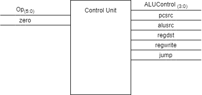

# Digital Design and Computer Architecture
## FP_3: Control Unit Design

# Introduction    
In this lab you will design the Control Unit for your processor and verify that your instructions are working correctly.  The control unit sets the signals which tell the components in the DPU what to do.  A control unit implements what is known as the "Decode" and "Execute" stages of an instruction’s life-cycle.  

Single-cycle and multiple-cycle machines will have different types of control units. 

* In a single-cycle machine, the control unit is essentially just fancy "look-up ROM" that acts somewhat like a python dictionary or a C++ map.  The instruction op-code functions like the input "key" and the control unit then returns the "value" which is placed on the control bus. The control bus consists of the set of wires that carry control signals to the components in the Data Path Unit (DPU). Each instruction will set these control signals to appropriate values that will cause the components in the DPU to behave appropriate to that instruction.

* In a multi-cycle machine, the control unit is implemented using a finite state machine.  In this case, each instruction op-code is the input to the machine which triggers a series of control signal states. All of the instruction share the "fetch" phase of the FSM, but, after decoding, each individual instruction will step through a specific set of states required for the execute phase of the instruction.


# Exercise 1: Control Unit Design
Have your Assembly Language, ALU, and DPU designs easily accessible while you work on this design. 

1.	Make a table here to list all the op-codes for the instructions supported by your design:

|Opcode|Opcode (binary)|Instruction|
|------|---------------|-----------|
|0|0000|ADI|
|1|0001|ADD|
|2|0010|AND|
|3|0011|ORR|
|4|0100|XOR|
|5|0101|BEQ|
|6|0110|JMP|
|7|0111|SLL|
|8|1000|SRL|
|9|1001|SUB|


2.	Control Bus Design: List all the individual control signals required by each comomponent in the Data Path Uhit (i.e. the ALU, any muxes, an program counters, etc.)

|Description|
|-----------|
|The ALU requires an ALU control signal which determines the ALU operation and whether the zero signal should be sent out|
|The mux that feeds the ALU requires a signal to determine whether the value it gives the ALU should be from readdata2 or from the immediate pulled of the end of an immediate type instruction. This signal comes from alusrc.|
|The mux that feeds into the program counter gets a signal which decides whether to feed the PC the jump address or the next address in the IM. This signal comes from the jump signal, if the current instruction was a jump then the jump address is chosen.|
|The multiplexer used for branches requires a signal to determine if it needs to beed the branch address to the program counter. This signal comes from pcsrc.|
|The multiplexer used to determine if the value from the alu or from the readData should be stored to a register uses the signal memtoreg to determine if memory should go to the register or not.|
|The flip flop register for the program counter uses a signal from the clock to determeine the next program counter.|
|The open pathway into the and gate recieves a signal from the control unit telling it to be a 1 for branch instructions or a 0 for any other instruction|
|The register file gets the regwrite signal from the control unit which indicates whether or not the operation it is carrying out will write its result to a register, in addition the register file gets a signal from the clock|

3.	Control Unit (CU) Design:



a.	SINGLE CYCLE CU DESIGN:  Create decoder tables for your CPU (e.g. See pages 383-387 of your textbook for examples of decoder tables.)

|ALUOp|Meaning|
|-----|-------|
|000|Addition|
|111|Subtraction|
|001|Bitwise AND|
|010|Bitwise OR|
|011|Bitwise XOR|
|100|Shift left logical|
|101|Shift right logical|

|Instruction|Opcode|RegWrite|RegDst|ALUSrc|Branch|Jump|ALUOp|
|-----------|------|--------|------|------|------|----|-----|
|ADI|0000|1|0|1|0|0|000|
|ADD|0001|1|1|0|0|0|000|
|AND|0010|1|1|0|0|0|001|
|ORR|0011|1|1|0|0|0|010|
|XOR|0100|1|1|0|0|0|011|
|BEQ|0101|0|X|0|1|0|001|
|JMP|0110|0|X|X|X|1|XXX|
|SLL|0111|1|1|0|0|0|100|
|SRL|1000|1|1|0|0|0|101|
|SUB|1001|1|1|0|0|0|111|

b.	MULTI CYCLE CU DESIGN: If you are doing a multi-cycle CPU draw out the entire bubble chart FSM for your design. (e.g. see pages 398-408 in your textbook for an example of the finite state machine design for the multi-cycle mips processor).  HINT:  You may find it very helpful to place the FSM into a table form (e.g. markdown table or excel spreadsheet), remember, every FSM can be drawn as a table (adjacency list) or as a graph.(nodes/edges))


## Exercise 2: Integrated VHDL for the Control Unit and the Data Path Unit

Using the tables and finite state machine diagrams from the previous steps, design the VHDL for the control unit of your processor.  

### SINGLE CYCLE CONTROL UNIT DESIGN:  
For an example, look at the MIPS single cycle control unit. The VHDL is on pages 431, 432 of the textbook. However there are small differences so you will also want to look at your MIPS3 processor’s control unit code.

```
library IEEE;
use IEEE.STD_LOGIC_1164.ALL;
use IEEE.math_real.all;

entity control_unit is
    Port ( 
        op : in std_logic_vector(3 downto 0);
        zero : in std_logic;
        pcsrc, alusrc : out std_logic;
        regdst, regwrite : out std_logic;
        jump : out std_logic;
        alucontrol : out std_logic_vector(3 downto 0)
    );
end control_unit;

architecture Behavioral of control_unit is
    component main_decoder
        port(
            op : in std_logic_vector(3 downto 0);
            branch, alusrc : out std_logic;
            regdst, regwrite : out std_logic;
            jump : out std_logic;
            aluop : out std_logic_vector(2 downto 0)
        );
    end component;
    
    component alu_decoder
        port(
            aluop : in std_logic_vector(2 downto 0);
            alucontrol : out std_logic_vector(3 downto 0)
        );
    end component;
    
    signal aluop : std_logic_vector(2 downto 0);
    signal branch : std_logic;
    
begin
    md : main_decoder port map( op => op, branch => branch, alusrc => alusrc, regdst => regdst,
                           regwrite => regwrite, jump => jump, aluop => aluop);

    ad : alu_decoder port map( aluop => aluop, alucontrol => alucontrol);
    
    pcsrc <= branch and zero;

end Behavioral;
```

### MULTI-CYCLE CONTROL UNIT DESIGN:  
For this, you will want to refresh your memory on how to write code for a Finite State Machine. See pages 212 and 213 in your textbook.  The main idea here is that you can design a control unit Finite State Machine using the concept of "microcode".  Microcode is like a mini-assembly/finite state machine language that you can lay out like shown below. It's basically a textual description of the FSM bubbles like those shown on pages 212, 213 of your textbook.

```
    FETCH:   
            IM_READ <= '1'                            # Read from instruction memory
            WAIT:  WHILE IM_READY != '1' GOTO WAIT:   # wait for memory ready signal
            INSTRUCTION_REG <= MEMORY_OUT_BUF         # Load instruction register
            GOTO DECODE:

    DECODE: 
            OPCODE <= INSTRUCTION_REG( ?? downto ?? ) # Get Opcode from INSTRUCTION_REG register
            NEXT_STATE <= CU[ OPCODE ]                # Lookup NEXT_STATE in the Control Unit
            GOTO NEXT_STATE:                          # Next State for each instruction

#  THE NEXT STATE FOR EACH INSTRUCTION

    LW :
            Do all the states for LW for your processor
            GOTO FETCH:
    
    SW :    
            Do all the states for SW for your processor
            GOTO FETCH:

    ADD:    
            Set signals for the ALU to ADD
            Take output from ALU and put it where it belongs
            GOTO FETCH:
```

## Exercise 3:  VHDL Testbench With Simple Adhoc Program Running Correctly
Design a simple ad-hoc test program for your processor. This should use every instruction you intend for it to execute.  Remember, you will need to put the hex code into a data file that can be read by your VHDL code. 

* IMPORTANT: Every time you change your hexcode file contents, you must verify by using the simulator in Vivado that your updated hexcode program loaded into the simulated microprocessor's instruction memory correctly. Refresh your memory on how to use the debugger in the test-bench to verify the contents of the program have loaded correctly into your instruction memory.

* Make a simple ad-hoc program that executes every instruction at least one time, and verifies that each instruction is working as intended. 

## Exercise 4: Mini Presentation FP3
1.	Show the class your control unit design. If you have a multi-cycle, you must show your bubble diagram state machine diagram. For a single-cycle machine you must show your decoder tables.
2.	Demo your ad-hoc program running (either in simulation or on the FPGA)
3.	What hardware bugs did you encounter in testing? How did you find them? How did you squash them?
4.	Did you go above and beyond the assignment requirements in any way?


## What to Hand In
This document with the following items included. Only one document necessary per group this time.  
* VHDL code for your completed design the FP3 subfolder of your group's whitgit repository
* List of instructions and op-codes.
* Control signals lists.
* SINGLE-CYCLE: Neatly drawn decoder tables.
* MULTI-CYCLE: Neatly drawn FSM bubble diagram and/or microcode table/spreadsheet for the multi-cycle design. 
* jpg/png files that demonstrate your microprocessor is running the ad-hoc program correctly.
  
## Make sure to have a correct .gitignore for the VHDL code!


| CATEGORY |  Beginning 0%-79% | Satisfactory 80%-89% | Excellent 90%-100% |
|:--------:|:-----------:|:------------:|:----------:|
| 25 pts. Control Unit Design | Rudimentary decoder tables. | Basic decoder tables and/or basic finite state machine bubble diagram for the control unit. | Neat, well commented, complete set of decoder tables (single cycle)  or neat, well commented complete finite state machine bubble diagram and tables  (multi-cycle). |
| 25 pts. Control Unit VHDL | VHDL code for the control unit. Few comments.	Partially working VHDL code for the control unit. Satisfactory comments. | Working VHDL code for the control unit. | Excellent comments, code formatted neatly, etc. |
| 25 pts. Control Unit Test  | Simulation test bench created but not documented well or does not work properly |	Single ad-hoc test code that tests every possible instruction. |	Both an ad-hoc program AND a more advanced program that runs correctly. |
| 25 pts. Mini Presentation | Little to no content, poor presentation. | Several of the required elements for Exercise 4 | All the required elements of Exercise 4 and a good presentation.

